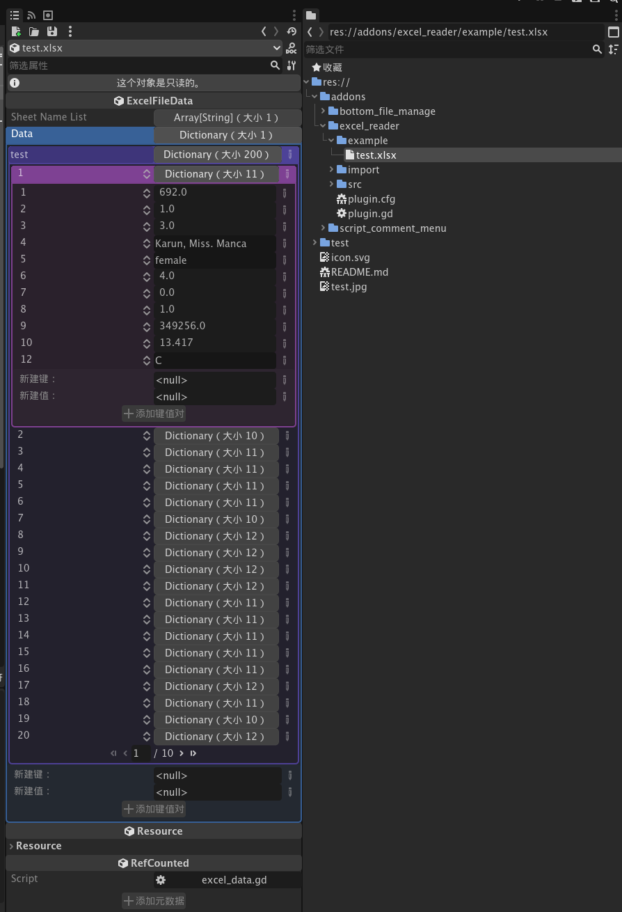
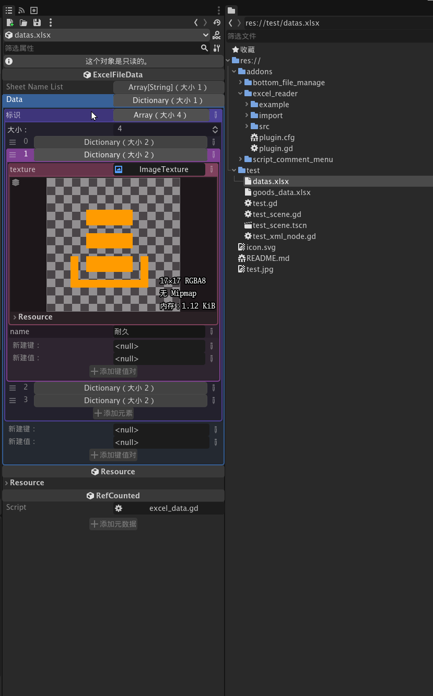

# Godot Excel Reader

[](https://godotengine.org/)
[](https://lbesson.mit-license.org/)

Reading excel files. 

**During the writing function test, there may be risks associated with its use**.

**写入功能试验中，使用可能会有风险！**


---

The keys of the imported data by default are 1, 2, 3...



 

The formatted data uses its row number as the key name.



---

## Example

Load xlsx file data

```gdscript
var excel_data := load(xlsx_path) as ExcelFileData
#var excel_data := ExcelFileData.load_file(xlsx_path)
var table_data = excel_data.get_sheet_data("Sheet1")
print(JSON.stringify(table_data, "\t"))
for row in table_data:
	var column_data = table_data[row]
	for column in column_data:
		print(column_data[column])
```


## Contribute

Any contributions is welcome! If you find any bugs, please report in `issues`.
